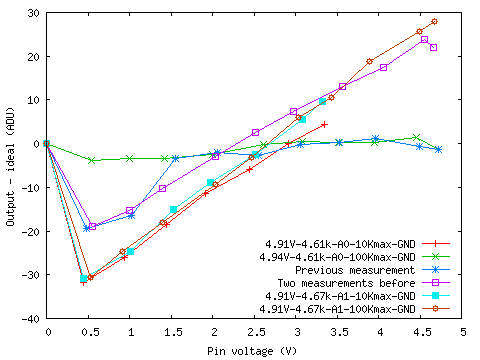

arduino-thermostat
==================

Trying to replace a broken Differential Temperature Thermostat DTT-94 with an Arduino


太陽熱温水器のサーモスタットが壊れたので代わりのものをつくる

壊れたもの
--------

Differential Temperature Thermostat DTT-94, Heliotrope General

温度計はSAS-10というもののようだ。パネルから温水が戻ってくる配管のタンクの近くにひとつとりつけられている。もうひとつはパネルにとりつけられているものと思われる。回路計では両方とも温度を検出しているような抵抗値を示していた。

温度計の仕様
----------

下記にSAS-10の温度(F)-抵抗のテーブルがある
* http://www.heliodyne.com/products_systems/control_units/SAS-10-RT.pdf
* http://www.heliodyne.com/products_systems/control_units/DeltaT.pdf

これを
[resistance-vs-temperature.xlsx](SAS-10/resistance-vs-temperature.xlsx)
にまとめた。
0℃から100℃までを測定しようとすると、32.65kΩから678.4Ωまでを測定する必要がある。

### 近似式
http://en.wikipedia.org/wiki/Thermistor#Steinhart.E2.80.93Hart_equation
より
```
t(r)=1/(a+b*log(r)+c*(log(r)**3))-273.16
```
ただしrは抵抗値(Ω)、tは温度(℃)。

[resistance-vs-temperature.plot](SAS-10/resistance-vs-temperature.plot)
で0-100℃の範囲を[フィット](SAS-10/fit.log)すると

| Parameter | Best fit (1/K) |
|---|------------|
| a | 0.00112974 |
| b | 0.00023399 |
| c | 8.8342e-08 |


Arduinoでの抵抗値の読み
--------------------
* `analogRead(pin)`は0から5ボルトの入力電圧を0から1023の数字に変換する
* `analogReference(type)`はアナログ入力で使われる基準電圧を設定する。
  * `DEFAULT`: 電源電圧(5V)
  * `INTERNAL`: 内蔵基準電圧(1.1V、2.56V)
  * `EXTERNAL`: AREFピンへの電圧(0-5V、32KΩでGNDへ)

* http://www.eleki-jack.com/FC/2011/09/arduino2-3.html
  温度計はGNDとアナログ入力の間、アナログ入力と電源の間に固定抵抗
* http://homepage3.nifty.com/sudamiyako/zk/AVR_ADC/AVR_ADC.html
  Sample & Holdコンデンサに注意

分圧抵抗の大きさで分解能が変わるんだねえ。

分圧抵抗の大きさはどの程度が良いか。
Vcc=Vref=5VからR1と温度計Rtを直列にGNDまで接続して、
その接続点の電圧Vadcを読む場合、

```
Vadc = Vref * Rt/(Rt+R1)
```

となる。測定したいRtの範囲がRminからRmaxの場合、
対応する電圧は、

```
Vmin = Vref * Rmin/(Rmin+R1)
Vmax = Vref * Rmax/(Rmax+R1)
```

となる。`Δ = Vmax/Vref - Vmin/Vref` が最大になるとき
`∂Δ/∂R1 = 0`となる。これをR1について解くと、

```
R1 = √(Rmin*Rmax) = 4.7 kΩ
```

となる。分圧抵抗R1は4.7 kΩとするのが良さそう。
このとき、この回路を流れる電流の最大は、`Rt = Rmin = 678.4Ω`のとき
1.1 mA。

Arduino (ATmega328) の注意点
----------------------------
http://www.atmel.com/Images/doc8161.pdf

* [ ] 使っていない入力ピンは消費電力を減らすため内部でプルアップしておくのがシンプル p.80
* [ ] AREFはAD変換器に直接つながっていてGNDとの間をコンデンサでつなぐことで雑音を減らすことができる p.256
* [ ] AVCC近く、GNDとの間に100nF、VCCとの間に10μHをつなぐことで雑音を減らすことができる p.258

MintDuinoでの試験
-----------------
手元に[MintDuino](http://makezine.com/projects/build-a-mintronics-mintduino/)と
[FTDI Friend](http://www.adafruit.com/products/284)
があるのでそれを使う。

### 最小の回路図


### アナログ入力を読んでシリアルポートに出力してみる
Latitude X1のDebianに入れたarduinoパッケージのarduinoコマンドがIDE。
* `Tools`-`Board`-`Arduino Duemilanove w/ ATmega328`
* `Tools`-`Serial Port`-`/dev/ttyUSB0`
* `File`-`Upload (Ctrl+U)` でコンパイル、アップロード、実行
* `Tools`-`Serial Monitor (Ctrl+Shift+M)` でシリアルモニター

`File`-`Examples`-`Basics`-`ReadAnalogVoltage`を改造して(`delay`を加えて)
下記のようにして、モニタを開いたら読めているようだ。

```
/*
  ReadAnalogVoltage
  Reads an analog input on pin 0, converts it to voltage, and prints the result to the serial monitor.
  Attach the center pin of a potentiometer to pin A0, and the outside pins to +5V and ground.

 This example code is in the public domain.
 */

// the setup routine runs once when you press reset:
void setup() {
  // initialize serial communication at 9600 bits per second:
  Serial.begin(9600);
}

// the loop routine runs over and over again forever:
void loop() {
  // read the input on analog pin 0:
  int sensorValue = analogRead(A0);
  // Convert the analog reading (which goes from 0 - 1023) to a voltage (0 - 5V):
  float voltage = sensorValue * (5.0 / 1023.0);
  // print out the value you read:
  Serial.println(voltage);
  delay(100);
}
```

* `delay(100)`で9V電池からの電流は31.5mA。
* `delay(1000)`で9V電池からの電流は28.6mA。

### Cで読む
[read-serial.c](read-serial/read-serial.c) で実験中。

* [ ] [2014-05-25現在](https://github.com/zunda/arduino-thermostat/blob/3682cf5b1333f6444b46643b6de784ea26261bb9/read-serial/read-serial.c)では先方からデータと改行が来ないとプログラムを終えることができない

### 温度計と抵抗を配線して値をしばらく記録してみる
[ReadAdc.ino](ReadAdc/ReadAdc.ino) で実験した。

```
~/local/src/arduino-thermostat/read-serial/read-serial | tee -a ~/tmp/`date +%Y%m%d`.log
```

#### 温度の記録
[20140526.log](ReadAdc/test/20140526.log)

2014-05-26 11:39:27 から始めたログは、
2014-05-27 10:04:08で終わってしまっていた。
9Vの電池が切れたようだ。

* `delay(60000)`
* A0:4.61kΩ+温水タンク直上のSAS-10
* A1:4.65kΩ+太陽熱温水パネル上の、たぶんSAS-10


[20140526.plot](ReadAdc/test/20140526.plot)により、読みを温度に変換したもの。

#### ADCの較正
ADCからの出力が±30ADUほどずれることがあるようだ。

値を抵抗に変換してみたとろ、
[2014-05-25に](https://github.com/zunda/arduino-thermostat/blob/23d273027570fb3063d9018775317773f0e071a8/Control/Control.ino)
抵抗値を測定した時に、読みにずれが見られた。

読みのずれを系統的に測定した。ピンA0とA1を4.7kΩ程度の抵抗器でプルアップし、
GNDとの間に10kΩまた100kΩの可変抵抗をとりつけて、
デジボルでピンの電圧を測定しながらADCの結果を読み記録した。

ADCの結果と
それぞれ一連の測定の前に測定したVccとピン電圧から期待されるADCの出力との差は
下図のようになった。



特にA0に100kΩを接続した場合の測定(紫色)は他の測定と異なる特徴を示したため
2回測定をやりなおしたところ、毎回異なる結果となった(青、緑)。
最後の、精度が良かった測定の際には、他の測定とは異なり、
三端子レギュレータ7805が熱くなっていなかった。
回路あるいは測定系の状態によって、測定精度が変化している可能性がある。

なお、測定はブレッドボードに組んだ回路を用いておこなった。
プリント基板に実装した場合にはこの不安定性は無くなるのだろうか？
* [ ] ダイオードによる入力保護の試験をしたら、プリント基板に組み始める必要がありそうだ

### 値を抵抗や温度に変換してみる
[Control.ino](Control/Control.ino) で実験中。

* [ ] 入力保護


本番機
-----

### 買い物

Radioshcakで揃うか?Amazonに行く必要があるか?電源on/offの制御をする部分がRadioshackには無いな。

* [x] メイン基板 [RadioshackのPrinted Circuit Board with 780 holes](http://www.radioshack.com/product/index.jsp?productId=2103800)
* [x] Arduinoマイコン - MintDuinoからATmega328を流用する
* [x] CR - 手持ちの実験用のものを流用する
* [x] 28ピンのICソケット - 14ピンx2で代用
* 入出力保護 http://www.designer2k2.at/home/arduino/63-arduino-io-protection.html
  * PowerSwitch Tail IIを使う場合には出力保護も必要
  * [x] ダイオード4本+2本
  * [x] 22Ω程度の小さい抵抗が2本+1本
  * [x] 100nFか100pF程度のコンデンサが2本+1本
* [ ] 100nFと10μH AVCCの雑音低減
* [x] 100nF AREFの雑音低減
* [x] FTDI friend
* [x] 電源 9Vとか
* [x] 電源コネクタ
* 出力リレー - 制御対象はGrundfos UP15-29SU 115V 0.75 A http://www.amazon.com/dp/B0018LA39I
  * [ ] PowerSwitch Tail II http://www.powerswitchtail.com/Pages/default.aspx - 信号入力3-12Vdc 3-30mA、制御対象120Vac 15A。
    * 良さそう。DC電源はもらえないか。
* [x] LED表示 電源、データ取得

* [ ] 入力ターミナル - 4端子+2端子
* [ ] 外部とのUSB接続の方法を考える USB-B - USB-miniケーブル?
* [ ] ケース
